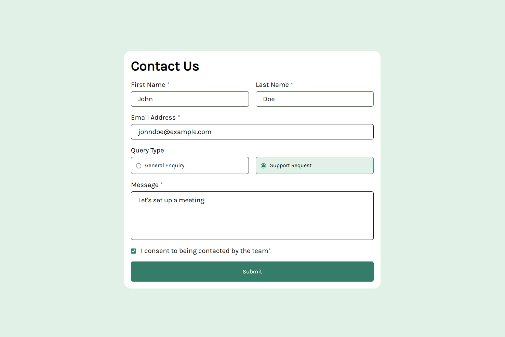

# Frontend Mentor - Contact form solution [[Live Here](https://contact-form-frontend-mentor-rouge.vercel.app/)]

This is a solution to the [Contact form challenge on Frontend Mentor](https://www.frontendmentor.io/challenges/contact-form--G-hYlqKJj).

## Overview

### Screenshot



### Links

- Solution URL: [Add solution URL here](https://github.com/AKR2803/contact-form-frontend-mentor)
- Live Site URL: [Add live site URL here](https://contact-form-frontend-mentor-rouge.vercel.app/)

## My process

### Built with

- Semantic HTML5 markup
- CSS custom properties
- Flexbox

### What I learned

- Basic form validation and styling.
- Custom styling radio buttons based on user preferences using JavaScript

### Useful resources

- [Arrays .some() method](https://developer.mozilla.org/en-US/docs/Web/JavaScript/Reference/Global_Objects/Array/some#parameters) : This method can especially be useful to check if some radio button is checked among a group of radio buttons.
- [In the code](https://github.com/AKR2803/contact-form-frontend-mentor/blob/main/script/script.js#L64) the method is used something like this:

  ```javascript
    let radios = document.querySelectorAll("input[type='radio']");
    
    // error radio is the error msg for input type radio
    let errorRadio = document.querySelector('.error-text-radio');

    if(radios){
        // radios is NodeList, to use .some() method we need to convert it to an array first
        // .some() says as long as some element of the array is satifying a condition return true
        // Ref : [https://developer.mozilla.org/en-US/docs/Web/JavaScript/Reference/Global_Objects/Array/some]
        let isChecked = Array.from(radios).some(radio => radio.checked);

        // if no radio button is checked then show the error under radio buttons and assign `isValid = false`
        if(!isChecked){
            errorRadio.style.display = "block";
            isValid = false;
        } 
        // else the radio button part is valid
        else{
            errorRadio.style.display = "none";
        }
    }
  ```